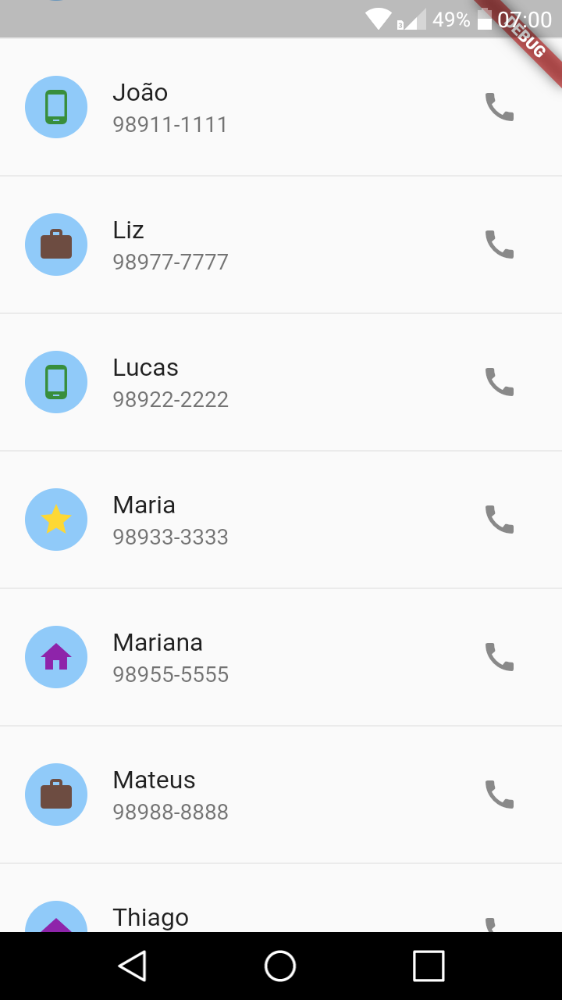

# Lista de Contatos

Projeto do curso Primeiros passos com Flutter que exibe uma lista fictícia de contatos.

Testado no Android e no Linux.

## Començando
Alguns recursos para você começar, se este for seu primeiro projeto Flutter:

- [Primeiros passos com Flutter](https://digitalinnovation.one)
- [Lab: Write your first Flutter app](https://flutter.dev/docs/get-started/codelab)
- [Cookbook: Useful Flutter samples](https://flutter.dev/docs/cookbook)

Para obter ajuda para começar a usar o Flutter, consulte a [documentação](https://flutter.dev/docs), que oferece tutoriais, exemplos, orientação sobre desenvolvimento móvel e uma referência completa de API.
